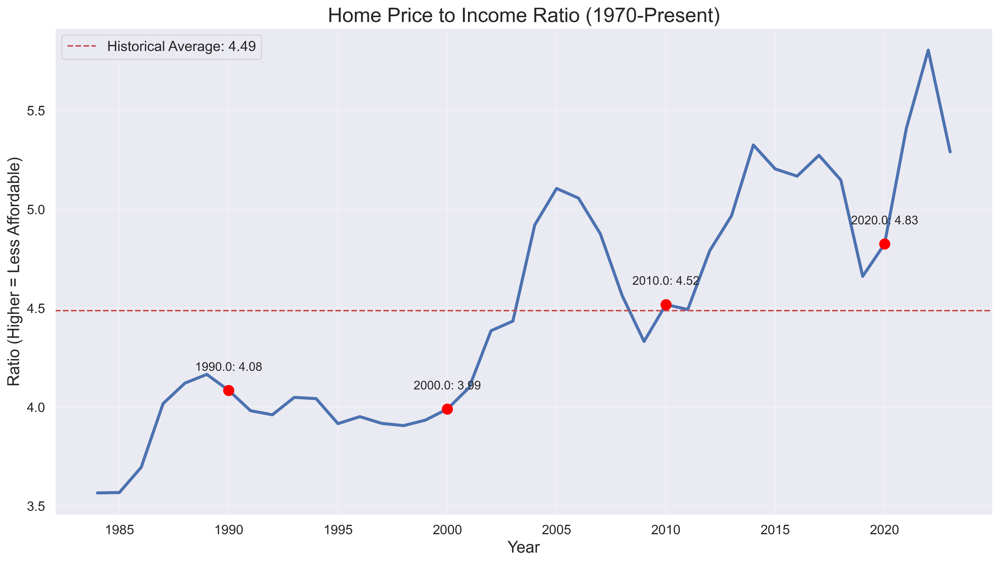

# Housing Affordability Time Machine

## Project Overview
This project compares current economic conditions with historical periods, focusing on housing affordability, wages, and cost of living. The analysis includes interactive visualizations and "what would need to happen" metrics to return to historical affordability levels.



## Key Features
- Historical comparison of housing prices vs. income (1970-present)
- Inflation-adjusted economic indicators across multiple decades
- "What would need to happen" calculations to return to historical affordability
- Interactive Power BI dashboard with filtering capabilities
- Comprehensive SQL analysis of economic trends

## The Problem
Housing affordability has reached crisis levels in America, with today's homebuyers facing significantly steeper challenges than previous generations. By examining key metrics like the home price-to-income ratio, median home prices, and median household incomes adjusted for inflation, this dashboard reveals just how much would need to change to return to historical affordability levels. The findings highlight that today's housing landscape requires over 3,700% income growth to match 1980s affordability – an economic reality that fundamentally alters the American Dream of homeownership.

## Data Sources
- Federal Reserve Economic Data (FRED)
  - Median Home Price (MSPUS)
  - Median Household Income (MEHOINUSA646N)
  - Consumer Price Index (CPIAUCSL)
- Manual compilation of historical data for:
  - Federal minimum wage
  - College tuition costs

## Project Structure
```
economic-comparison-project/
├── data/
│   ├── raw/              # Original downloaded data
│   ├── processed/        # Cleaned and analyzed data
│   └── database/         # SQLite database files
├── scripts/
│   ├── data_collection.py    # Scripts to download data
│   └── create_database.py    # Scripts to create SQLite database
├── notebooks/
│   └── economic_analysis.ipynb   # Jupyter notebook with analysis
├── powerbi/
│   └── Economic_Comparison.pbix  # Power BI dashboard
├── sql_queries.sql        # SQL queries for additional insights
└── README.md              # This file
```

## Key Findings
- Housing affordability has declined significantly since the 1970s
- The price-to-income ratio has increased dramatically, making housing much less affordable today
- To return to 1980s affordability levels, either:
  - Home prices would need to decrease substantially
  - OR incomes would need to increase by over 3,700%
- When adjusted for inflation, housing prices have grown much faster than incomes
- The most affordable decade for housing was the 1970s

## How to Use This Project

### Prerequisites
- Python 3.8+ with pip
- Power BI Desktop
- Git

### Setup Instructions
1. Clone this repository:
   ```
   git clone https://github.com/yourusername/economic-comparison-project.git
   cd economic-comparison-project
   ```

2. Create a virtual environment and install dependencies:
   ```
   python -m venv venv
   venv\Scripts\activate  # Windows
   source venv/bin/activate  # Mac/Linux
   pip install -r requirements.txt
   ```

3. Run the data collection script:
   ```
   python scripts/data_collection.py
   ```

4. Create the SQLite database:
   ```
   python scripts/create_database.py
   ```

5. Open and run the Jupyter notebook:
   ```
   jupyter notebook notebooks/economic_analysis.ipynb
   ```

6. Open the Power BI dashboard (requires Power BI Desktop):
   ```
   powerbi/Economic_Comparison.pbix
   ```

## Dashboard Pages

### 1. Housing Affordability Overview
- Historical trend of home price to income ratio
- Key metrics including latest year's ratio, home price, and income
- Interactive year slicer for filtering data
- Historical average benchmark line for context

### 2. Affordability Gap Analysis
- Visualization of what would need to change to return to historical affordability
- Comparison of home price decrease needed vs. income increase needed
- Detailed data table with year-by-year comparisons

### 3. Decade Comparison
- Analysis of housing affordability by decade
- Inflation-adjusted prices and incomes over time
- Detailed metrics for each decade showing the evolution of the housing market

## Technologies Used
- **Python**: For data collection, cleaning, and analysis
- **SQLite**: For database storage and SQL analysis
- **Power BI**: For interactive data visualization
- **Pandas & NumPy**: For data manipulation
- **Matplotlib & Seaborn**: For exploratory data visualization

## Future Enhancements
- Add regional housing market data for geographic comparisons
- Include additional economic indicators (healthcare, transportation, etc.)
- Create time-series forecasting models to predict future trends
- Build an interactive web dashboard using Dash or Streamlit

## Medium Article
A detailed Medium article examining these findings and their implications will be published soon. Stay tuned!

